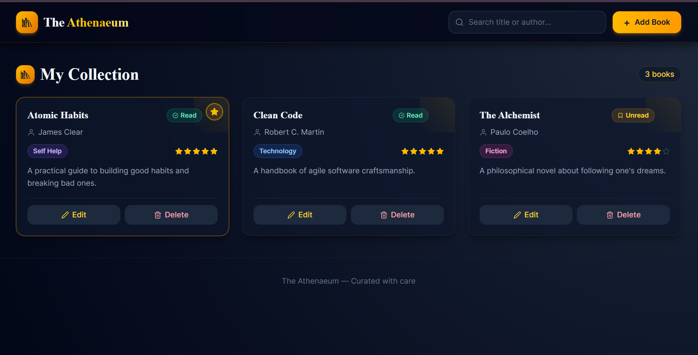

# 📚 The Athenaeum – Personal Book Library

<div align="center">


### A modern and elegant personal library management application.

Manage your book collection effortlessly with a beautiful interface designed for readers who love keeping track of their favorite books.

</div>

---

## ✨ Features

### 📖 Manage Your Collection
- Add books to your personal library.
- Edit book details anytime.
- Remove books from your collection.
- Keep your library organized in one place.

### 📌 Reading Status Tracking
Track your reading journey with status indicators:

- ✅ Read
- 🔖 Unread

### ⭐ Book Ratings
Rate books using a simple 5-star rating system.

- Visual star ratings
- Easily update ratings
- Quickly identify your favorites

### 🔍 Search Books
Find books instantly by searching through:

- Book titles
- Author names

### 🎨 Elegant User Experience
Designed with a premium library aesthetic featuring:

- Dark-themed interface
- Golden accent colors
- Responsive book cards
- Smooth hover effects
- Clean typography
- Intuitive navigation

---

## 🖼️ Preview

### Dashboard




---

## 🛠️ Tech Stack

| Technology | Purpose |
|------------|-----------|
| React | Building User Interfaces |
| Vite | Fast Development & Build Tool |
| Tailwind CSS | Styling |
| JavaScript (ES6+) | Application Logic |
| React Icons | Icons |

---

## 📂 Project Structure

```bash
Personal-Book-Library/
│
├── public/
├── src/
│   ├── components/
│   │   ├── BookCard.jsx
│   │   ├── BookForm.jsx
│   │   ├── Navbar.jsx
│   │   └── CustomSelect.jsx
│   │
│   ├── App.jsx
│   ├── main.jsx
│   └── index.css
│
├── assets/
├── package.json
├── vite.config.js
└── README.md
```

---

## 🚀 Getting Started

### Prerequisites

Make sure you have:

- Node.js (v18 or later)
- npm

Check installed versions:

```bash
node -v
npm -v
```

---

### Installation

Clone the repository:

```bash
git clone https://github.com/your-username/personal-book-library.git
```

Navigate to the project directory:

```bash
cd personal-book-library
```

Install dependencies:

```bash
npm install
```

---

### Run the Development Server

```bash
npm run dev
```

Open your browser and visit:

```text
http://localhost:5173
```

---

### Build for Production

```bash
npm run build
```

Preview the production build:

```bash
npm run preview
```

---

## 🎯 Future Improvements

Potential enhancements for future versions:

- 💾 Persist data using Local Storage
- ☁️ Integrate with a backend (Node.js/FastAPI)
- 🔐 User authentication
- 📚 Support book cover uploads
- ❤️ Favorites and wishlist features
- 📊 Reading analytics dashboard
- 📱 Progressive Web App (PWA) support

---

## 🤝 Contributing

Contributions are welcome!

To contribute:

1. Fork the repository.
2. Create a feature branch.

```bash
git checkout -b feature/your-feature
```

3. Commit your changes.

```bash
git commit -m "Add your feature"
```

4. Push to GitHub.

```bash
git push origin feature/your-feature
```

5. Open a Pull Request.

---

## 📝 License

This project is licensed under the MIT License.

---

## 👨‍💻 Author

**Abhik Kundu**

Computer Science Engineering Student passionate about building elegant and user-friendly web applications.

- GitHub: https://github.com/abhik-kundu09

---

<div align="center">

### 📚 The Athenaeum

*"Curated with care."*


</div>